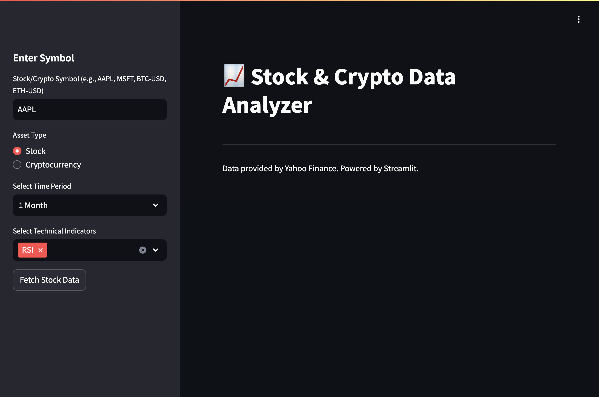
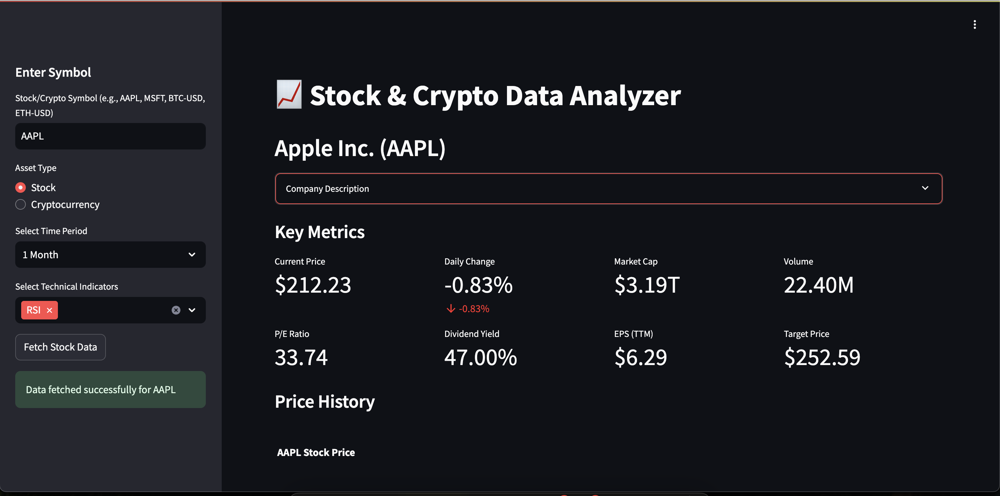
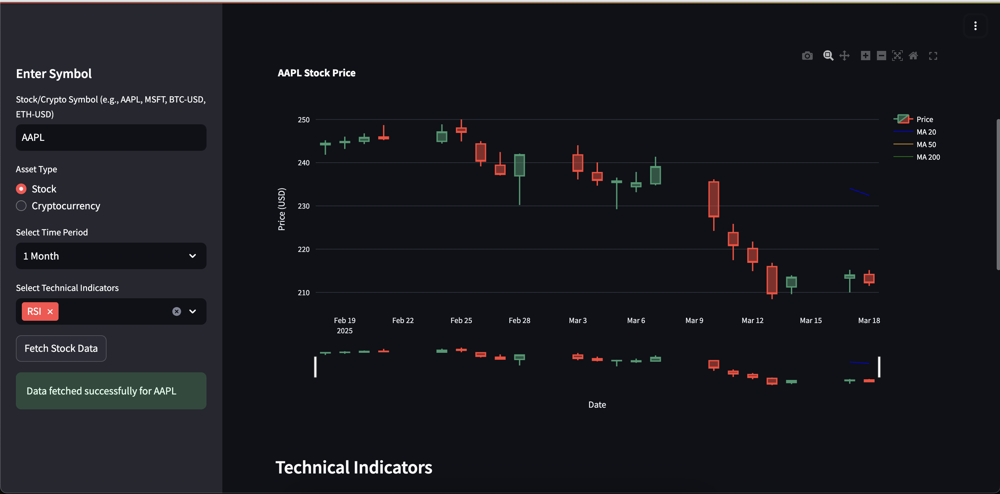
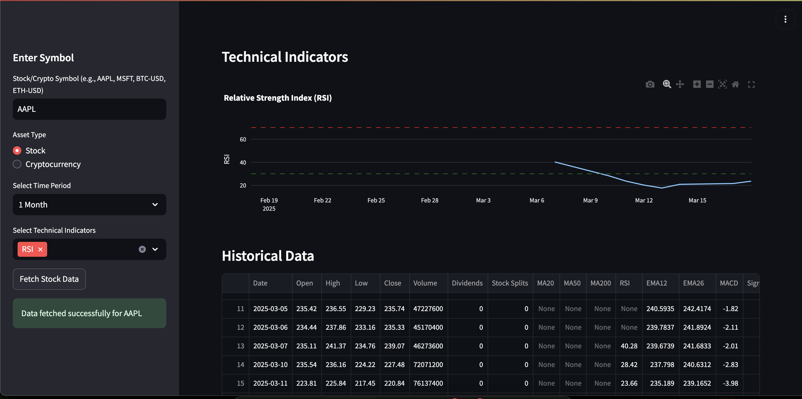

# StockSense: Financial Data Analyzer


## Overview

StockSense is a powerful financial data analysis application built with Streamlit that allows users to analyze stocks and cryptocurrencies in real-time. The application fetches data from Yahoo Finance and provides interactive charts and technical indicators to help users make informed investment decisions.

## Application Preview

### Dashboard Overview


### Technical Analysis View




The user interface was designed using Figma, focusing on clarity, usability, and a modern aesthetic. The design emphasizes data visualization while maintaining an intuitive navigation flow, making financial analysis accessible to both beginners and experienced traders.

### Key Features Showcased

1. **Main Dashboard** (first screenshot): Displays the overview with key metrics, current price, and primary candlestick chart with moving averages
   - Asset information and description
   - Key financial metrics
   - Interactive price chart with zoom functionality

2. **Technical Analysis** (second screenshot): Shows detailed technical indicators and analysis tools
   - Multiple technical indicators displayed simultaneously
   - RSI (Relative Strength Index) with overbought/oversold thresholds
   - MACD (Moving Average Convergence Divergence) with signal line and histogram
   - Bollinger Bands showing price volatility and potential reversal points
   - Historical data visualization with customizable time periods

### User Workflow

StockSense is designed with an intuitive workflow that allows users to:

1. Start with the **Dashboard Overview** to quickly assess the asset's current status and recent price movements
2. Dive deeper into the **Technical Analysis View** for detailed trend analysis and trading signals
3. Switch between different time periods (1 month to 5 years) to identify both short-term opportunities and long-term trends
4. Compare multiple technical indicators simultaneously to confirm signals and reduce false positives
5. Easily switch between stocks and cryptocurrencies to analyze different asset classes with the same powerful tools

### Figma Design Elements

- **Color Scheme**: A professional blue and white palette with accent colors for indicators and data visualization
- **Typography**: Clean, readable fonts (Inter and Roboto) optimized for data-heavy displays
- **Layout**: Responsive grid system with sidebar navigation and main content area
- **Interactive Components**: Custom-designed buttons, selectors, and expandable information panels
- **Data Visualization**: Candlestick charts and technical indicators with consistent styling

[View Original Figma Design](https://www.figma.com/file/stocksense-design) (Replace with your actual Figma link)

### UI/UX Implementation

The Streamlit application implements the Figma design concepts with:

- Sidebar navigation for user inputs and controls
- Expandable sections for detailed information
- Interactive charts with tooltips and zoom functionality
- Responsive layout that adapts to different screen sizes
- Visual hierarchy that prioritizes the most important information

## Features

- **Real-time Data**: Fetch the latest stock and cryptocurrency data from Yahoo Finance
- **Interactive Charts**: Visualize price movements with interactive candlestick charts
- **Technical Indicators**: Analyze market trends with multiple technical indicators:
  - Moving Averages (20, 50, 200 days)
  - Relative Strength Index (RSI)
  - Moving Average Convergence Divergence (MACD)
  - Bollinger Bands
- **Key Metrics**: View essential financial metrics like current price, daily change, market cap, and trading volume
- **Flexible Time Periods**: Analyze data across different time frames (1 month to 5 years)
- **Responsive Design**: Optimized for both desktop and mobile viewing

## Installation

### Prerequisites

- Python 3.11 or higher
- pip (Python package manager)

### Step 1: Clone the repository

```bash
git clone https://github.com/yourusername/StockSense.git
cd StockSense
```

### Step 2: Install dependencies

```bash
pip install -r requirements.txt
```

Or using the project's dependencies from pyproject.toml:

```bash
pip install numpy pandas plotly streamlit yfinance
```

## Usage

### Running the application

```bash
streamlit run app.py
```

The application will start and can be accessed at `http://localhost:8501` in your web browser.

### Basic Navigation

1. **Enter Symbol**: Type a stock symbol (e.g., AAPL, MSFT) or cryptocurrency (e.g., BTC-USD, ETH-USD) in the sidebar
2. **Choose Asset Type**: Select whether you're analyzing a stock or cryptocurrency
3. **Select Time Period**: Choose the time range for analysis
4. **Select Technical Indicators**: Choose which technical indicators to display
5. **Fetch Data**: Click the "Fetch Data" button to load and analyze the asset

## Technical Details

### Components

- **Streamlit**: Framework for creating the web application
- **yfinance**: API wrapper to fetch data from Yahoo Finance
- **Pandas**: Data manipulation and analysis
- **Plotly**: Interactive data visualization
- **NumPy**: Numerical computing for technical indicators

### Technical Indicators Explained

- **Moving Averages**: Show the average price over a specific period, smoothing price action and identifying trends
- **RSI (Relative Strength Index)**: Momentum oscillator that measures the speed and change of price movements on a scale from 0 to 100
- **MACD (Moving Average Convergence Divergence)**: Trend-following momentum indicator showing the relationship between two moving averages
- **Bollinger Bands**: Volatility bands placed above and below a moving average, helping identify overbought or oversold conditions

## Example Use Cases

1. **Day Trading Analysis**: Use short-term charts and RSI to identify entry and exit points
2. **Long-term Investment Research**: Analyze 5-year trends and moving averages to make informed investment decisions
3. **Cryptocurrency Market Analysis**: Track volatility and price movements in the crypto market
4. **Portfolio Monitoring**: Keep track of your investments' performance

## Contributing

Contributions are welcome! Please feel free to submit a Pull Request.

1. Fork the repository
2. Create your feature branch (`git checkout -b feature/amazing-feature`)
3. Commit your changes (`git commit -m 'Add some amazing feature'`)
4. Push to the branch (`git push origin feature/amazing-feature`)
5. Open a Pull Request

## License

This project is licensed under the MIT License - see the LICENSE file for details.

## Acknowledgments

- Yahoo Finance for providing the financial data API
- Streamlit for the wonderful web application framework
- The open-source community for the various packages that made this project possible

---

*Note: StockSense is for informational purposes only and does not provide financial advice. Always conduct your own research before making investment decisions.* 